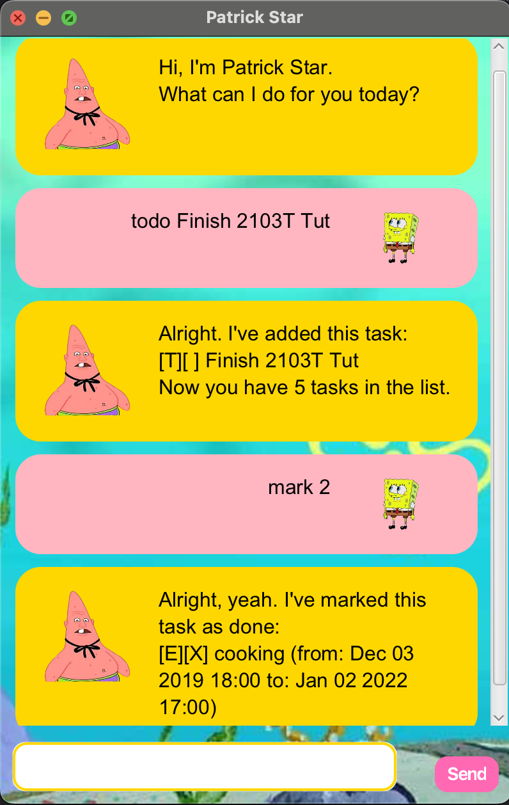

# Patrick Star - User Guide



Patrick Star is a friendly task management chatbot that helps you keep track of your todos, deadlines, and events!

## Quick Start

1. Download the latest `PatrickStar.jar` from the [releases page](../../releases)
2. Double-click the jar file to launch
3. Start chatting with Patrick!

## Features

### Adding Tasks

Patrick can help you manage three types of tasks:

#### 1. Todo Tasks
Simple tasks without any date/time.

**Format:** `todo DESCRIPTION`

**Example:**
```
todo read book
```

**Expected output:**
```
Alright. I've added this task:
  [T][ ] read book
Now you have 1 task in the list.
```

#### 2. Deadlines
Tasks with a specific due date.

**Format:** `deadline DESCRIPTION /by DATE`

**Date format:** `yyyy-MM-dd` (e.g., 2026-02-20)

**Example:**
```
deadline submit report /by 2026-02-20
```

**Expected output:**
```
Alright. I've added this task:
  [D][ ] submit report (by: Feb 20 2026)
Now you have 2 tasks in the list.
```

#### 3. Events
Tasks with start and end times.

**Format:** `event DESCRIPTION /from DATETIME /to DATETIME`

**DateTime format:** `yyyy-MM-dd HHmm` (e.g., 2026-02-20 1400)

**Example:**
```
event team meeting /from 2026-02-20 1400 /to 2026-02-20 1600
```

**Expected output:**
```
Uhhh... I've added this task:
  [E][ ] team meeting (from: Feb 20 2026 2:00 PM to: Feb 20 2026 4:00 PM)
Now you have 3 tasks in the list.
```

### Viewing Tasks

#### List All Tasks
See all your tasks at once.

**Format:** `list`

**Example output:**
```
Here are the tasks in your list:
1. [T][ ] read book
2. [D][ ] submit report (by: Feb 20 2026)
3. [E][ ] team meeting (from: Feb 20 2026 2:00 PM to: Feb 20 2026 4:00 PM)
```

### Managing Tasks

#### Mark Task as Done
Mark a task as completed.

**Format:** `mark TASK_NUMBER`

**Example:**
```
mark 1
```

**Expected output:**
```
Alright, yeah. I've marked this task as done:
  [T][X] read book
```

#### Unmark Task
Mark a task as not done.

**Format:** `unmark TASK_NUMBER`

**Example:**
```
unmark 1
```

**Expected output:**
```
Alright I will unmark this task:
  [T][ ] read book
```

#### Delete Task
Remove a task from your list.

**Format:** `delete TASK_NUMBER`

**Example:**
```
delete 1
```

**Expected output:**
```
Alright yeah. I will remove this task:
  [T][ ] read book
Now you have 2 tasks in the list.
```

### Finding Tasks

Search for tasks containing a specific keyword.

**Format:** `find KEYWORD`

**Example:**
```
find report
```

**Expected output:**
```
Uhhhhhhhhhhhh, here are the matching tasks in your list:
1. [D][ ] submit report (by: Feb 20 2026)
```

### Getting Help

View all available commands.

**Format:** `help`

**Example output:**
```
Uhhh... here are the things I can help you with:
- todo DESCRIPTION
- deadline DESCRIPTION /by DATE
- event DESCRIPTION /from DATETIME /to DATETIME
- list
- mark TASK_NUMBER
- unmark TASK_NUMBER
- delete TASK_NUMBER
- find KEYWORD
- bye
```

### Exiting

Close the application.

**Format:** `bye`

**Example output:**
```
Uhhh... bye! See you later!
```

The application will automatically close after 1 second.

## Command Summary

| Command | Format | Example |
|---------|--------|---------|
| Add Todo | `todo DESCRIPTION` | `todo read book` |
| Add Deadline | `deadline DESCRIPTION /by DATE` | `deadline submit report /by 2026-02-20` |
| Add Event | `event DESCRIPTION /from DATETIME /to DATETIME` | `event meeting /from 2026-02-20 1400 /to 2026-02-20 1600` |
| List Tasks | `list` | `list` |
| Mark Done | `mark TASK_NUMBER` | `mark 1` |
| Unmark | `unmark TASK_NUMBER` | `unmark 1` |
| Delete | `delete TASK_NUMBER` | `delete 1` |
| Find | `find KEYWORD` | `find book` |
| Help | `help` | `help` |
| Exit | `bye` | `bye` |

## Tips

1. **Date Format:** Always use `yyyy-MM-dd` for deadlines (e.g., 2026-12-31)
2. **DateTime Format:** Always use `yyyy-MM-dd HHmm` for events (e.g., 2026-12-31 2359)
3. **Task Numbers:** Task numbers start from 1 (not 0)
4. **Case Sensitive Search:** The `find` command is case-sensitive


**Enjoy organizing your tasks with Patrick Star!** 
